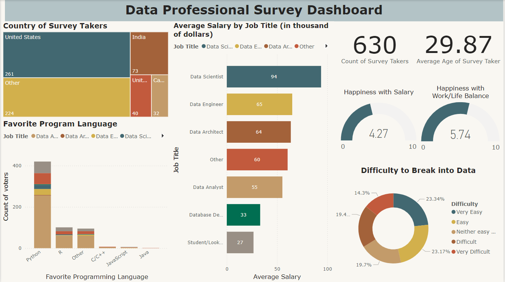

# Data Professionals Survey Analysis

## Table of Contents
  - [Objective](#objective)
  - [Dataset](#dataset)
  - [Tools](#tools)
  - [Methodology](#methodology)

### Objective

The primary goal of this project is to conduct a deep analysis and show the results of a survey made to data professionals in a comprehensive dashboard.

### Dataset

The dataset of Data Professional Survey (https://t.ly/oBTVD) contains the following key features:

- Unique ID: Identification code of the surveyee
- Email: Email of the surveyee
- Q1 Which Title Best Fits your Current Role?: The answers include Data Analyst, Data Architect, Data Engineer, Data Scientist, Student/Looking/None, and other.
- Q2 Did you switch careers into Data?: The answers are yes or no.
- Q3 Current Yearly Salary (in USD): The answers are between eight options, such as 0-40K, 41K-65K, 66K-85K, etc.
- Q4 What Industry do you work in?: The answers are between nine options, such as finance, healthcare, telecommunication, construction etc.
- Q5 Favorite Programming Language: The answers are between six options, such as Python, R, C/C++, etc.
- Q6 How Happy are you in your Current Position with the following? (Salary): The answers range from 1 to 10, where one is very dissatisfied, and ten is very satisfied.
- Q6 How Happy are you in your Current Position with the following? (Work/Life Balance): The answers range from 1 to 10, where one is very dissatisfied, and ten is very satisfied.
- Q6 How Happy are you in your Current Position with the following? (Coworkers): The answers range from 1 to 10, where one is very dissatisfied, and ten is very satisfied.
- Q7 How difficult was it for you to break into Data?: The answers range from easy to very difficult.
- Q8 If you were to look for a new job today, what would be the most important thing to you?: The answers are remote work, good work/life balance, better salary, good culture, and other.
- Q9 Male/Female? The answers are Male or Female.
- Q10 Current Age: Current age of the surveyee.
- Q11 Which Country do you live in?: Country where the surveyee lives.

### Tools
- Power Query for Data Cleaning
- Power BI for Data Visualization

### Methodology

#### 1. Data Collection and Preparation

The data cleaning done in Power Query includes:
- Data loading and inspection
- Removing unnecessary columns
- Handling missing and duplicate values
- Transforming values for easy analysis

#### 2. Data Visualization

[Dashboard Power BI](https://github.com/galaes/Data-Professionals-Survey-Analysis/blob/ed7275d1b3cbaef4a2feb063c11661958e2b1bec/Data%20Professional%20Survey%20Dashboard.pbix)

#### 3. Insights and Findings

- Data Scientists and Engineers are the top earners in the industry, with $94K and 65K, respectively, but satisfaction with salary is only moderate. 
- Work and personal life balance seems better rated than salary satisfaction.
- According to the respondents, breaking into the data field is easy (easy and very easy represents 46.52% compared to 33.77% for difficult and very difficult).
- Python is the most popular programming language, cementing its role as a key tool in the data profession.
  
